PAV - P4: reconocimiento y verificación del locutor
===================================================

Obtenga su copia del repositorio de la práctica accediendo a [Práctica 4](https://github.com/albino-pav/P4)
y pulsando sobre el botón `Fork` situado en la esquina superior derecha. A continuación, siga las
instrucciones de la [Práctica 2](https://github.com/albino-pav/P2) para crear una rama con el apellido de
los integrantes del grupo de prácticas, dar de alta al resto de integrantes como colaboradores del proyecto
y crear la copias locales del repositorio.

También debe descomprimir, en el directorio `PAV/P4`, el fichero [db_8mu.tgz](https://atenea.upc.edu/pluginfile.php/3145524/mod_assign/introattachment/0/spk_8mu.tgz?forcedownload=1)
con la base de datos oral que se utilizará en la parte experimental de la práctica.

Como entrega deberá realizar un *pull request* con el contenido de su copia del repositorio. Recuerde
que los ficheros entregados deberán estar en condiciones de ser ejecutados con sólo ejecutar:

~~~~~~~~~~~~~~~~~~~~~~~~~~~~~~~~~~~~~~~~~~~~~~~~~~~~~.sh
  make release
  run_spkid mfcc train test classerr verify verifyerr
~~~~~~~~~~~~~~~~~~~~~~~~~~~~~~~~~~~~~~~~~~~~~~~~~~~~~

Recuerde que, además de los trabajos indicados en esta parte básica, también deberá realizar un proyecto
de ampliación, del cual deberá subir una memoria explicativa a Atenea y los ficheros correspondientes al
repositorio de la práctica.

A modo de memoria de la parte básica, complete, en este mismo documento y usando el formato *markdown*, los
ejercicios indicados.

## Ejercicios.

### SPTK, Sox y los scripts de extracción de características.

- Analice el script `wav2lp.sh` y explique la misión de los distintos comandos involucrados en el *pipeline*
  principal (`sox`, `$X2X`, `$FRAME`, `$WINDOW` y `$LPC`). Explique el significado de cada una de las 
  opciones empleadas y de sus valores.
  
  `Sox: Explicar què és i que fa`

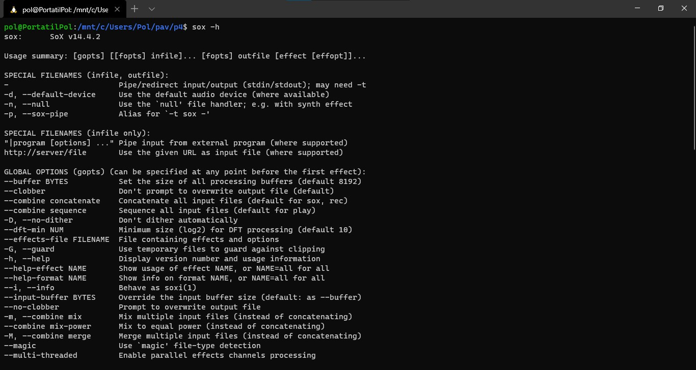

`x2x: Explicar què és i que fa`

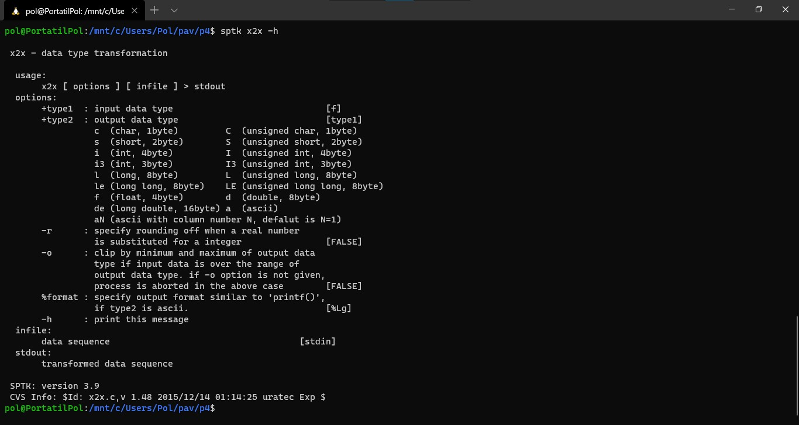

`Frame: Explicar què és i que fa`

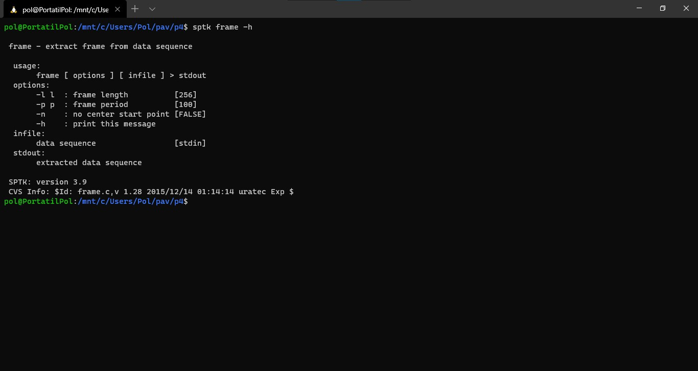

`Window: Explicar què és i que fa`

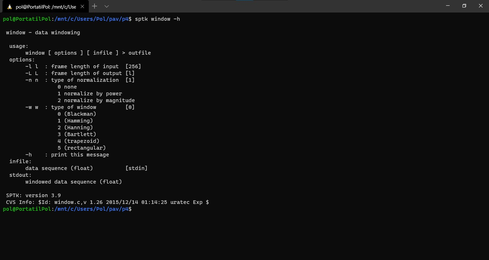

`LPC: Explicar què és i que fa`

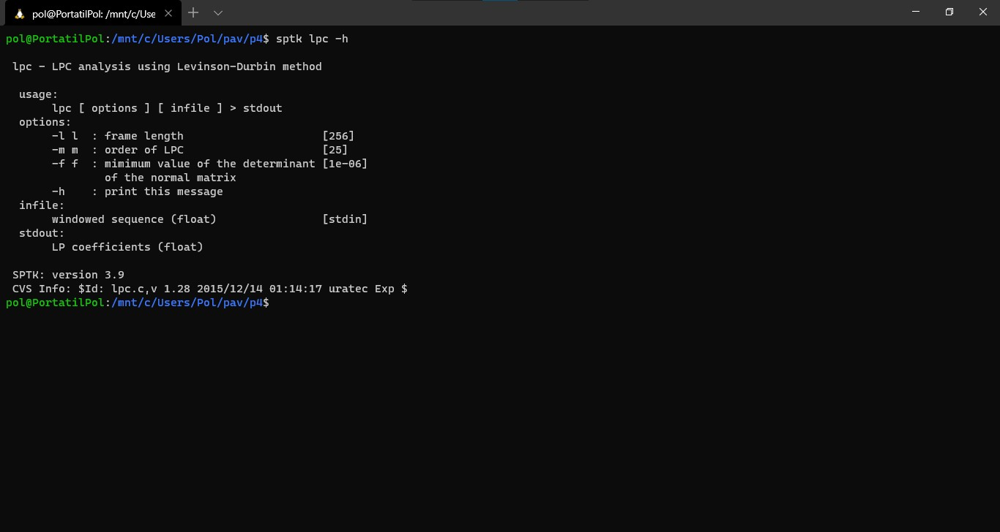

- Explique el procedimiento seguido para obtener un fichero de formato *fmatrix* a partir de los ficheros de
  salida de SPTK (líneas 45 a 47 del script `wav2lp.sh`).
 
  `Explicar que fa de la línia 41 a 47. És el que va explicar a classe un bon rato (explicar-ho molt bé i amb detall)`

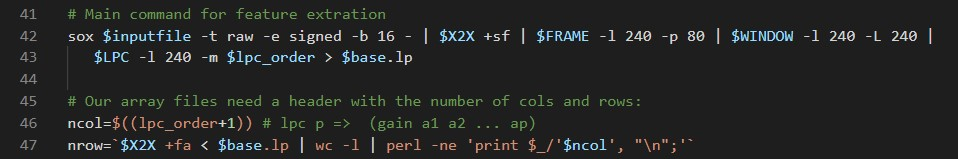

  * ¿Por qué es conveniente usar este formato (u otro parecido)? Tenga en cuenta cuál es el formato de
    entrada y cuál es el de resultado.
    
  `Explicar amb detall també.`

- Escriba el *pipeline* principal usado para calcular los coeficientes cepstrales de predicción lineal
  (LPCC) en su fichero <code>scripts/wav2lpcc.sh</code>:

  `Si buscamos la función lpc2c en el manual:`

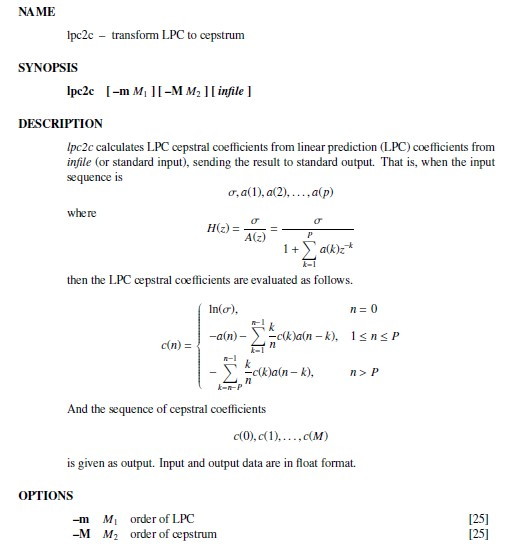

  `Donde la pipeline principal que hemos escrito es:`

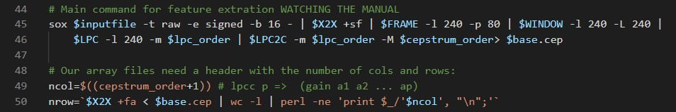

`En el apartado de LPCC el -l es 'frame length del input', y -m es el orden del LPC. Además en el apartado de LPC2C el -m es el orden del LPC y -M el orden del cepstrum.`

`Le pasamos los siguientes parámetros, mirando antes el manual:`

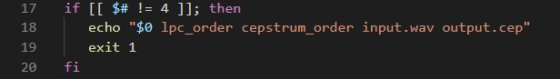

`Y después añadimos la función compute_lpcc() en el fichero run_spkid.sh:`

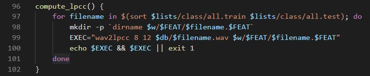

- Escriba el *pipeline* principal usado para calcular los coeficientes cepstrales en escala Mel (MFCC) en su
  fichero <code>scripts/wav2mfcc.sh</code>:

`Si buscamos la función mfcc en el manual:`

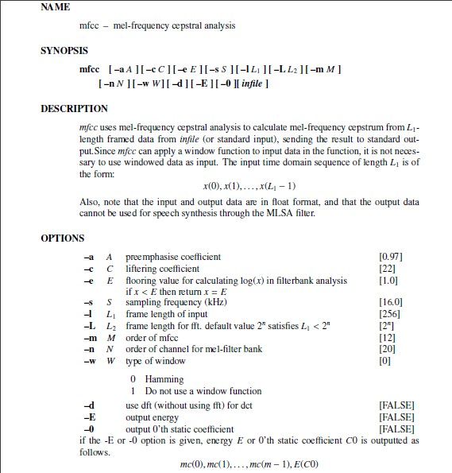

 `Donde la pipeline principal que hemos escrito es:`

`En el apartado de MFCC el -l es 'frame length del input', y -m es el orden del MFCC.`

`Le pasamos los siguientes parámetros, mirando antes el manual:`

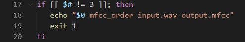

`Y después añadimos la función compute_mfcc() en el fichero run_spkid.sh:`

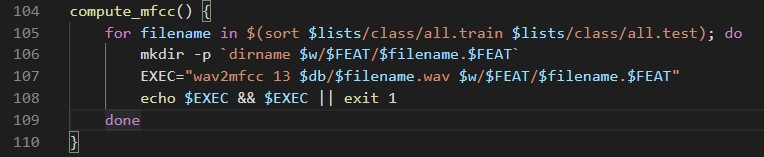

### Extracción de características.

- Inserte una imagen mostrando la dependencia entre los coeficientes 2 y 3 de las tres parametrizaciones
  para todas las señales de un locutor.

  + Indique **todas** las órdenes necesarias para obtener las gráficas a partir de las señales 
    parametrizadas.
    
Con el comando `fmatrix_show work/lp/BLOCK01/SES017/*.lp | egrep '^\[' | cut -f4,5 > lp_2_3.txt` hemos guardado los valores en un archivo de texto y posteriormente lo hemos importado en MATLAB y vemos lo siguiente:

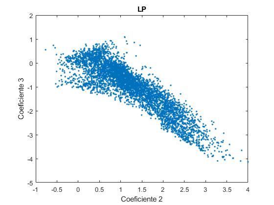

  + ¿Cuál de ellas le parece que contiene más información?
  
        Explicar el perquè, correlacio... etc

- Usando el programa <code>pearson</code>, obtenga los coeficientes de correlación normalizada entre los
  parámetros 2 y 3 para un locutor, y rellene la tabla siguiente con los valores obtenidos.
  
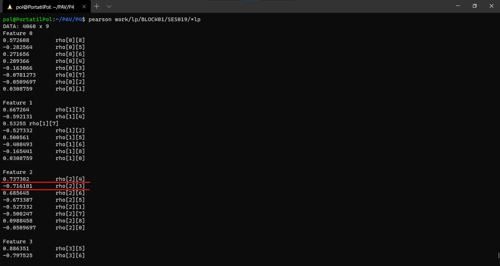
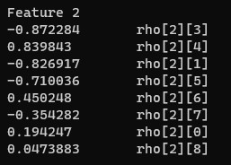
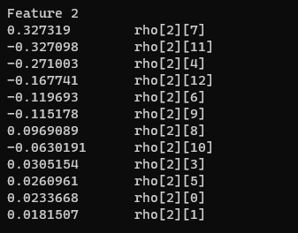
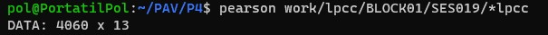
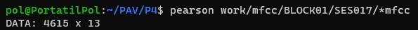
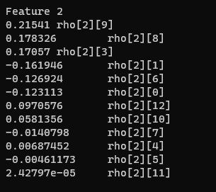

  |                        | LP   | LPCC | MFCC |
  |------------------------|:----:|:----:|:----:|
  | &rho;x[2,3] |  -0.872284  |  0.148411  |  0.17057  |
  
  + Compare los resultados de <code>pearson</code> con los obtenidos gráficamente.
  
        Explicar la comparació
  
- Según la teoría, ¿qué parámetros considera adecuados para el cálculo de los coeficientes LPCC y MFCC?

       Explicar la comparació

### Entrenamiento y visualización de los GMM.

Complete el código necesario para entrenar modelos GMM.

- Inserte una gráfica que muestre la función de densidad de probabilidad modelada por el GMM de un locutor
  para sus dos primeros coeficientes de MFCC.
  
  Locutor 00:

  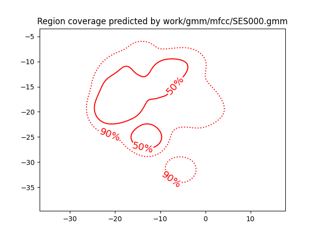
  
  Locutor 01:
  
  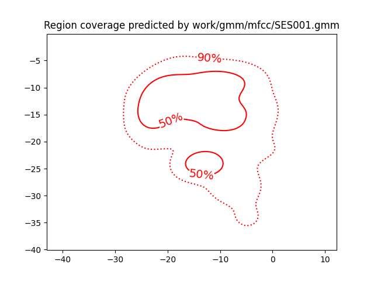

- Inserte una gráfica que permita comparar los modelos y poblaciones de dos locutores distintos (la gŕafica
  de la página 20 del enunciado puede servirle de referencia del resultado deseado). Analice la capacidad
  del modelado GMM para diferenciar las señales de uno y otro.

  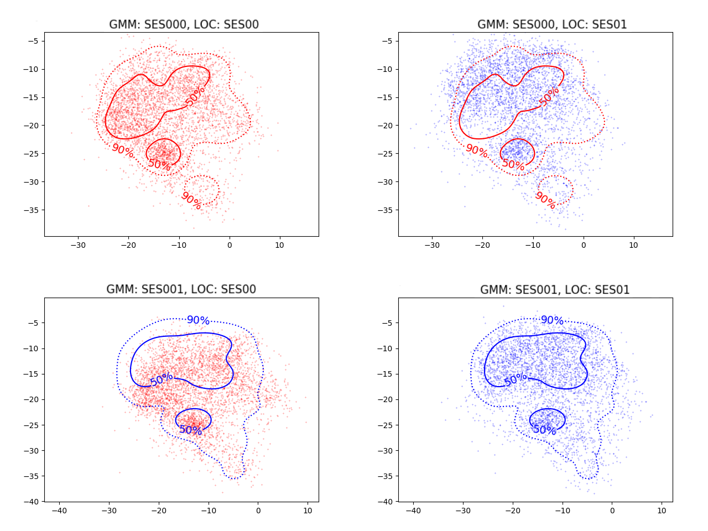

      En la gráfica podemos ver las regiones con el 90% y 50% de la masa de probabilidad para los GMM de los locutores SES000 (en rojo, arriba) y SES001 (en           azul, abajo); también se muestra la población del usuario SES000 (en rojo, izquierda) y SES001 (en azul, derecha).
      
      Si población y locutor no coinciden, vemos que no hay coincidencia entre las regiones y las poblaciones. Es decir, la densidad no se centra en el circulo       del % correspondiente. En las que si coincide, vemos con claridad que estan repartidas de manera correcta. Esto nos ayuda para diferenciar que candidatos       son impostores o usuarios legítimos.
      
### Reconocimiento del locutor.

Complete el código necesario para realizar reconociminto del locutor y optimice sus parámetros.

- Inserte una tabla con la tasa de error obtenida en el reconocimiento de los locutores de la base de datos
  SPEECON usando su mejor sistema de reconocimiento para los parámetros LP, LPCC y MFCC.
   
Hemos probado con el método VQ i EM-Split, ya que en teoria són mejores, pero los mejores resultados nos lo ha dado el método aleatorio, con un número elevado de gaussianas eso sí. Hemos decidido coger como método final el aleatorio ya que es en el que tenemos mejores resultados pese al largo cálculo de las tasas de error.
      
  La tasa de error del parámetro LP:
  
      Thu Dec 3 17:42:30 CET 2020: classerr ---
      nerr=92 ntot=785        error_rate=11.72%
      Thu Dec  3 17:42:30 CET 2020
      
La tasa de error del parámetro LPCC: 

      Thu Dec 3 17:47:08 CET 2020: classerr ---
      nerr=27 ntot=785        error_rate=3.44%
      Thu Dec  3 17:47:08 CET 2020
      
La tasa de error del parámetro MFCC:

      Thu Dec 3 17:38:43 CET 2020: classerr ---
      nerr=5  ntot=785        error_rate=0.64%
      Thu Dec  3 17:38:43 CET 2020
      
  Tabla final  usando *Random Mode*:
  
   |                        | LP   | LPCC | MFCC |
  |------------------------|:----:|:----:|:----:|
  |  Error Rate |  3.44%  |  11.72%  |  0.64% |
  
### Verificación del locutor.

Complete el código necesario para realizar verificación del locutor y optimice sus parámetros.

- Inserte una tabla con el *score* obtenido con su mejor sistema de verificación del locutor en la tarea
  de verificación de SPEECON. La tabla debe incluir el umbral óptimo, el número de falsas alarmas y de
  pérdidas, y el score obtenido usando la parametrización que mejor resultado le hubiera dado en la tarea
  de reconocimiento.
  
Nuestro mejor resultado ha sido con el MFCC:
  
      ==============================================
      THR: 1.00639006307311
      Missed:     42/250=0.1680
      FalseAlarm: 0/1000=0.0000
      ----------------------------------------------
      ==> CostDetection: 16.8
      ==============================================
      Thu Dec  3 17:26:06 CET 2020
      
El resultado con LPCC ha sido:
  
      ==============================================
      THR: 1.0404857498784
      Missed:     107/250=0.4280
      FalseAlarm: 3/1000=0.0030
      ----------------------------------------------
      ==> CostDetection: 72.5
      ==============================================
      Thu Dec  3 17:29:28 CET 2020
      
El resultado con LP ha sido:

      ==============================================
      THR: 1.3893933039959
      Missed:     225/250=0.9000
      FalseAlarm: 0/1000=0.0000
      ----------------------------------------------
      ==> CostDetection: 90.0
      ==============================================
      Thu Dec  3 17:32:51 CET 2020
    
 Por lo que la tabla final queda de la siguiente manera:
  
 |                        | LP   | LPCC | MFCC |
  |------------------------|:----:|:----:|:----:|
  |  Cost Detection |  90.0  |  72.5  |  16.8 |
  
### Test final

- Adjunte, en el repositorio de la práctica, los ficheros `class_test.log` y `verif_test.log` 
  correspondientes a la evaluación *ciega* final.

### Trabajo de ampliación.

- Recuerde enviar a Atenea un fichero en formato zip o tgz con la memoria (en formato PDF) con el trabajo 
  realizado como ampliación, así como los ficheros `class_ampl.log` y/o `verif_ampl.log`, obtenidos como 
  resultado del mismo.
