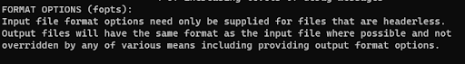
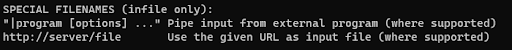

PAV - P4: reconocimiento y verificación del locutor
===================================================

Obtenga su copia del repositorio de la práctica accediendo a [Práctica 4](https://github.com/albino-pav/P4)
y pulsando sobre el botón `Fork` situado en la esquina superior derecha. A continuación, siga las
instrucciones de la [Práctica 2](https://github.com/albino-pav/P2) para crear una rama con el apellido de
los integrantes del grupo de prácticas, dar de alta al resto de integrantes como colaboradores del proyecto
y crear la copias locales del repositorio.

También debe descomprimir, en el directorio `PAV/P4`, el fichero [db_8mu.tgz](https://atenea.upc.edu/pluginfile.php/3145524/mod_assign/introattachment/0/spk_8mu.tgz?forcedownload=1)
con la base de datos oral que se utilizará en la parte experimental de la práctica.

Como entrega deberá realizar un *pull request* con el contenido de su copia del repositorio. Recuerde
que los ficheros entregados deberán estar en condiciones de ser ejecutados con sólo ejecutar:

~~~~~~~~~~~~~~~~~~~~~~~~~~~~~~~~~~~~~~~~~~~~~~~~~~~~~.sh
  make release
  run_spkid mfcc train test classerr verify verifyerr
~~~~~~~~~~~~~~~~~~~~~~~~~~~~~~~~~~~~~~~~~~~~~~~~~~~~~

Recuerde que, además de los trabajos indicados en esta parte básica, también deberá realizar un proyecto
de ampliación, del cual deberá subir una memoria explicativa a Atenea y los ficheros correspondientes al
repositorio de la práctica.

A modo de memoria de la parte básica, complete, en este mismo documento y usando el formato *markdown*, los
ejercicios indicados.

## Ejercicios.

### SPTK, Sox y los scripts de extracción de características.

- Analice el script `wav2lp.sh` y explique la misión de los distintos comandos involucrados en el *pipeline*
  principal (`sox`, `$X2X`, `$FRAME`, `$WINDOW` y `$LPC`). Explique el significado de cada una de las 
  opciones empleadas y de sus valores.
  
`sox: permite realizar la conversión de una señal de entrada sin cabecera a una del formato adecuado. Para la conversión se puede elegir cualquier formato de la señal de entrada y los bits utilizados entre otras cosas. Por ejemplo: sox, permite la conversión de una señal de entrada a reales en coma flotante de 32 bits con o sin cabecera.`
  

`Sox también permite la conversión de señales guardadas en un programa externo, para ello, solo hay que poner el URL de dicha señal, como señal de entrada.`

`x2x: es el programa de SPTK que permite la conversión entre distintos formatos de datos, tal como se puede observar en la siguiente imagen, permite bastantes tipos de conversión, desde convertir a un formato de caracteres, hasta un unsigned long long de 8 bytes. En el caso de convertir a valores numéricos, hay que especificar hasta dónde se quiere que se redondean los valores de salida.`

`Frame:divide la señal de entrada en tramas de “l” muestras con desplazamiento de ventana de periodo “p” muestras que se le indiquen y también puede elegir si el punto de comienzo es centrado o no. El valor máximo de “l” es de 256 y el de “p” es de 100. Un ejemplo sería poner: sptk frame -l 200 -p 40. En este caso le estamos pidiendo que nos divida la señal en tramas de 200 muestras, con un desplazamiento de 40 muestras.`

`Window: Multiplica cada trama por una ventana. Se puede elegir el número “l” de muestras por trama del fichero de entrada, que como mucho puede ser de 256 y “L” de muestras por trama del fichero de salida, que también como mucho puede ser 256, el tipo de normalización (si no tiene normalización, si tiene normalización power o magnitude) y el tipo de ventana que se desea utilizar, pudiendo escoger entre 6 opciones distintas de ventana, siendo las 6 ventanas más utilizadas. El tipo de dato de entrada y de salida ha de ser de tipo float.`

`LPC: Realiza un análisis de la señal, usando el método de Levinson-Durbin. Calcula los lpc_order de orden “m” (siendo como mucho 25) de los primeros coeficientes de predicción lineal, precedidos por el factor de ganancia del predictor. Se puede escoger el número “l” de muestras por trama (siendo como mucho 256) y el valor mínimo del determinante de la matriz normal (siendo como mucho 10^-6). Tanto la señal de entrada como la señal de salida tienen un formato float.`

- Explique el procedimiento seguido para obtener un fichero de formato *fmatrix* a partir de los ficheros de
  salida de SPTK (líneas 45 a 47 del script `wav2lp.sh`).
 
 `Tal como se puede apreciar en las líneas 42 y 43 de la imagen, inicialmente mediante el comando sox, pasamos la señal de entrada de .wav a una señal de salida unsigned int de 16 bits, sin cabecera ni ningún formato adicional. A continuación, con el comando x2x convertimos los datos de formato short a formato float. Después hacemos un FRAME donde dividimos la señal en tramas de 240 muestras (30 ms) con un desplazamiento de ventana de 80 muestras (10 ms). Una vez dividida la señal, hacemos un WINDOW, para enventanar la señal con una ventana Blackman con 240 muestras de entrada y de salida. Y finalmente con el comando LPC realizamos el cálculo de los ‘lpc_order’ de los primeros coeficientes de predicción lineal con el método de Levison-Durbin pasados por el parámetro -m y con un frame -l de 240 muestras. Una vez finalizado el proceso ponemos un comando ‘>$base.lp’ para redireccionar la salida al fichero $base.lp.
Una vez procesada la señal y guardada en un fichero, con los comandos de las líneas 42 y 43, en las líneas 46 y 47, procedemos a calcular el número de columnas y el número de filas. Para ello, sabiendo que en primer elemento del vector de predicción se almacena la ganancia del predictor, calculamos las columnas sumando uno al orden del predictor. Y teniendo en cuenta que queremos que en cada fila se almacene cada trama de la señal y cada columna para cada uno de los coeficientes con los que se parametriza la trama. Para realizar el cálculo del número de filas hemos de tener en cuenta la longitud de la señal y la longitud y desplazamiento de la ventana aplicada. Por eso, primero con el comando sox realizamos la conversión de datos del tipo float al tipo ascii. Y a continuación, contamos las líneas con el comando wc-1. Finalmente, ya tenemos creada la matriz, y la imprimimos.`

  * ¿Por qué es conveniente usar este formato (u otro parecido)? Tenga en cuenta cuál es el formato de
    entrada y cuál es el de resultado.
    
`Se usa este formato, porque para poder identificar correctamente los coeficientes por trama, la matriz nos es muy útil. Y el fichero fmatrix lo utilizamos, porque en este fichero se realiza la parametrización de una señal de voz usando coeficientes de predicción lineal, en el que hay que poner el número de filas y de columnas, seguidos por los datos. Los datos se almacenan en nrow filas de ncol columnas, en los que cada fila corresponde a una trama de señal, y cada columna a cada uno de los coeficientes con los se parametriza la trama. Así tenemos todos coeficientes de la señal a analizar en las diferenes columnas y podemos mostrarlos con el programas fmatrix_show y elegir los coeficientes 2 y 3, que son los que nos piden, con fmatrix_cut. Es decir, este formato, nos facilita trabajar de forma más eficiente con los datos.`

- Escriba el *pipeline* principal usado para calcular los coeficientes cepstrales de predicción lineal
  (LPCC) en su fichero <code>scripts/wav2lpcc.sh</code>:

  `Si buscamos la función lpc2c en el manual:`

  `Donde la pipeline principal que hemos escrito es:`

`En el apartado de LPCC el -l es 'frame length del input', y -m es el orden del LPC. Además en el apartado de LPC2C el -m es el orden del LPC y -M el orden del cepstrum.`

`Le pasamos los siguientes parámetros, mirando antes el manual:`

`Y después añadimos la función compute_lpcc() en el fichero run_spkid.sh:`

- Escriba el *pipeline* principal usado para calcular los coeficientes cepstrales en escala Mel (MFCC) en su
  fichero <code>scripts/wav2mfcc.sh</code>:

`Si buscamos la función mfcc en el manual:`

 `Donde la pipeline principal que hemos escrito es:`

`En el apartado de MFCC el -l es 'frame length del input', y -m es el orden del MFCC.`

`Le pasamos los siguientes parámetros, mirando antes el manual:`

`Y después añadimos la función compute_mfcc() en el fichero run_spkid.sh:`

### Extracción de características.

- Inserte una imagen mostrando la dependencia entre los coeficientes 2 y 3 de las tres parametrizaciones
  para todas las señales de un locutor.

  + Indique **todas** las órdenes necesarias para obtener las gráficas a partir de las señales 
    parametrizadas.
    
Con el comando `fmatrix_show work/lp/BLOCK01/SES017/*.lp | egrep '^\[' | cut -f4,5 > lp_2_3.txt` hemos guardado los valores en un archivo de texto y posteriormente lo hemos importado en MATLAB y vemos lo siguiente:

  + ¿Cuál de ellas le parece que contiene más información?
  
`A lo largo de esta práctica nos estamos refiriendo siempre a la correlación lineal, aunque no siempre tiene que ser así. En este caso el hecho de que dos parámetros esten corralados significa que teniendo información sobre uno de los parámetros, podemos deducir la información del siguiente. Sin embargo, si estos dos parámetros son incorralados, no es posible deducir la información del segundo parámetro conociendo la información del primero, ya que este podría tomar cualquier valor independientemente del valor del primero. Dado este hecho, podemos considerar que proporcionan el doble de información que uno sólo. Esto es exactamente lo que ocurre con la parametrización MFCC y la parametrización LPCC, los coeficientes están menos corralados, por lo que tenemos más información de la necesaria. `

- Usando el programa <code>pearson</code>, obtenga los coeficientes de correlación normalizada entre los
  parámetros 2 y 3 para un locutor, y rellene la tabla siguiente con los valores obtenidos.
  

  |                        | LP   | LPCC | MFCC |
  |------------------------|:----:|:----:|:----:|
  | &rho;x[2,3] |  -0.872284  |  0.148411  |  0.17057  |
  
  + Compare los resultados de <code>pearson</code> con los obtenidos gráficamente.
  
 ` Para realizar la comparación nos hemos basado en que si el resultado de rho es muy cercano a uno en valor absoluto, quiere decir que los dos coeficientes que comparamos están muy correlados entre sí. Basándonos en eso, vemos que en el caso de LP el valor absoluto de rho es -0,872284, un valor bastante cercano a uno, por tanto conociendo el valor de uno de los dos parámetros, podemos deducir el valor del otro. Por lo que se podría decir que la información que nos proporcionan los dos parámetros es la misma que la que proporciona la información de uno solo. `

`Por lo tanto, igual que se puede decir que en el LP los parámetros son corralados por que el valor absoluto de rho es cercano a 1, se puede decir lo opuesto en el caso de los LPCC y los MFCC. En estos dos últimos casos, el valor de rho es cercano a cero, por lo que se podría decir que sus parámetros son incorrelados entre sí. Esto nos dice que la información que nos proporcionan los dos parámetros es distinta a la que nos proporciona la información de uno solo. Por lo que la información conjunta de los dos parámetros nos proporciona el doble de información.` 

`Por las gráficas y los valores de rho obtenidos, podemos decir que los parámetros de LP son correlados, y los de LPCC y MFCC son incorralados. Siendo LPCC más incorralado que MFCC debido a que el valor de rho en los parametros LPCC es más cercano a cero que en el caso de los MFCC. Además mirando las gráficas lo podemos comprobar que se cumple esto último. `

- Según la teoría, ¿qué parámetros considera adecuados para el cálculo de los coeficientes LPCC y MFCC?

`Para los coeficientes LPCC se usa lpc_order=35 y el número de cepstrum es igual a nceps=24. Finalmente, hemos decidido incrementar estos valores para obtener mejores resultados.
Para los coeficientes MFCC se usan los primeros 13 coefficientes + un 25% más, por lo tanto mfcc_order=16. Y el numero de filtros suele ir de 24 a 40, por lo que usamos un valor intermedio de nfilter=26.`

### Entrenamiento y visualización de los GMM.

Complete el código necesario para entrenar modelos GMM.

- Inserte una gráfica que muestre la función de densidad de probabilidad modelada por el GMM de un locutor
  para sus dos primeros coeficientes de MFCC.
  
  Locutor 00:

  
  
  Locutor 01:
  
  

- Inserte una gráfica que permita comparar los modelos y poblaciones de dos locutores distintos (la gŕafica
  de la página 20 del enunciado puede servirle de referencia del resultado deseado). Analice la capacidad
  del modelado GMM para diferenciar las señales de uno y otro.

  

En la gráfica podemos ver las regiones con el 90% y 50% de la masa de probabilidad para los GMM de los locutores SES000 (en rojo, arriba) y SES001 (en           azul, abajo); también se muestra la población del usuario SES000 (en rojo, izquierda) y SES001 (en azul, derecha).
      
Si población y locutor no coinciden, vemos que no hay coincidencia entre las regiones y las poblaciones. Es decir, la densidad no se centra en el circulo       del % correspondiente. En las que si coincide, vemos con claridad que estan repartidas de manera correcta. Esto nos ayuda para diferenciar que candidatos       son impostores o usuarios legítimos.
      
### Reconocimiento del locutor.

Complete el código necesario para realizar reconociminto del locutor y optimice sus parámetros.

- Inserte una tabla con la tasa de error obtenida en el reconocimiento de los locutores de la base de datos
  SPEECON usando su mejor sistema de reconocimiento para los parámetros LP, LPCC y MFCC.
   
Hemos probado con el método VQ i EM-Split, ya que en teoria són mejores, pero los mejores resultados nos lo ha dado el método aleatorio, con un número elevado de gaussianas eso sí. Hemos decidido coger como método final el aleatorio ya que es en el que tenemos mejores resultados pese al largo cálculo de las tasas de error.
      
  La tasa de error del parámetro LP:
  
      Thu Dec 3 17:42:30 CET 2020: classerr ---
      nerr=92 ntot=785        error_rate=11.72%
      Thu Dec  3 17:42:30 CET 2020
      
La tasa de error del parámetro LPCC: 

      Thu Dec 3 17:47:08 CET 2020: classerr ---
      nerr=27 ntot=785        error_rate=3.44%
      Thu Dec  3 17:47:08 CET 2020
      
La tasa de error del parámetro MFCC:

      Thu Dec 3 17:38:43 CET 2020: classerr ---
      nerr=5  ntot=785        error_rate=0.64%
      Thu Dec  3 17:38:43 CET 2020
      
  Tabla final  usando *Random Mode*:
  
   |                        | LP   | LPCC | MFCC |
  |------------------------|:----:|:----:|:----:|
  |  Error Rate |  3.44%  |  11.72%  |  0.64% |
  
### Verificación del locutor.

Complete el código necesario para realizar verificación del locutor y optimice sus parámetros.

- Inserte una tabla con el *score* obtenido con su mejor sistema de verificación del locutor en la tarea
  de verificación de SPEECON. La tabla debe incluir el umbral óptimo, el número de falsas alarmas y de
  pérdidas, y el score obtenido usando la parametrización que mejor resultado le hubiera dado en la tarea
  de reconocimiento.
  
Nuestro mejor resultado ha sido con el MFCC:
  
      ==============================================
      THR: 1.00639006307311
      Missed:     42/250=0.1680
      FalseAlarm: 0/1000=0.0000
      ----------------------------------------------
      ==> CostDetection: 16.8
      ==============================================
      Thu Dec  3 17:26:06 CET 2020
      
El resultado con LPCC ha sido:
  
      ==============================================
      THR: 1.0404857498784
      Missed:     107/250=0.4280
      FalseAlarm: 3/1000=0.0030
      ----------------------------------------------
      ==> CostDetection: 72.5
      ==============================================
      Thu Dec  3 17:29:28 CET 2020
      
El resultado con LP ha sido:

      ==============================================
      THR: 1.3893933039959
      Missed:     225/250=0.9000
      FalseAlarm: 0/1000=0.0000
      ----------------------------------------------
      ==> CostDetection: 90.0
      ==============================================
      Thu Dec  3 17:32:51 CET 2020
    
 Por lo que la tabla final queda de la siguiente manera:
  
 |                        | LP   | LPCC | MFCC |
  |------------------------|:----:|:----:|:----:|
  |  Cost Detection |  90.0  |  72.5  |  16.8 |
  
### Test final

- Adjunte, en el repositorio de la práctica, los ficheros `class_test.log` y `verif_test.log` 
  correspondientes a la evaluación *ciega* final.

Aquí están los links que le permiten acceder directamente a los ficheros [`class_test.log`](https://github.com/polvalls9/P4/blob/pol-remei/class_test.log) y [`verif_test.log`](https://github.com/polvalls9/P4/blob/pol-remei/verif_test.log)
### Trabajo de ampliación.

- Recuerde enviar a Atenea un fichero en formato zip o tgz con la memoria (en formato PDF) con el trabajo 
  realizado como ampliación, así como los ficheros `class_ampl.log` y/o `verif_ampl.log`, obtenidos como 
  resultado del mismo.
